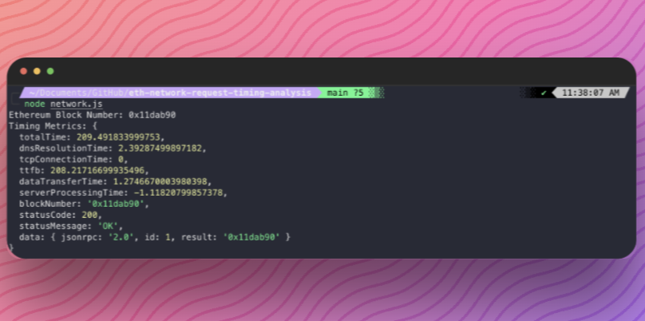
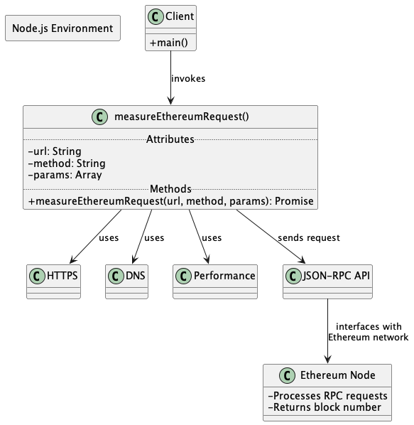

# Ethereum Network Request Timing Analysis Tool


## Overview

This Node.js script is designed to measure various network timing metrics for Ethereum JSON-RPC requests. It is particularly useful for developers interested in analyzing the performance of Ethereum network interactions, focusing on the efficiency and speed of RPC (Remote Procedure Call) requests to Ethereum nodes.



## Installation

Before running this script, ensure you have Node.js installed on your system. You can download it from the Node.js Official Website.

1. Clone or Download the Script: Clone or download this script into your local environment.
2. Setting Up: No additional dependencies are required outside of Node.js standard libraries.
3. Configuration: Replace the `rpcUrl` variable value with your Ethereum node's RPC URL. If using services like Infura or QuickNode, ensure you have the correct endpoint URL.

## Usage

Run the script using Node.js:

```
node path/to/script.js
```

## When to Run This Script

- Performance Analysis: Useful when analyzing the performance of Ethereum RPC calls, especially if experiencing slow response times.
- Troubleshooting Network Issues: Helpful if suspecting network-related delays or issues in Ethereum node communications.
- Comparative Analysis: Ideal for comparing the performance of different Ethereum nodes or providers.
- Regular Monitoring: Can be part of a regular monitoring strategy to proactively identify and resolve issues.

## What It Returns

The script outputs the following metrics:

- Total Time: The overall time taken for the Ethereum RPC request to complete.
- DNS Resolution Time: The time taken to resolve the domain name of the Ethereum node into an IP address.
- TCP Connection Time: The time taken to establish a TCP connection with the node. This includes the time until the TLS handshake starts in HTTPS connections.
- TLS Handshake Time: The duration of the TLS handshake process for establishing a secure HTTPS connection.
- Time to First Byte (TTFB): The duration from the start of the request to the receipt of the first byte of response. It is indicative of network latency and initial server response time.
- Server Processing Time: An estimate of the time the server takes to process the request, calculated as `TTFB - (DNS Resolution Time + TCP Connection Time)`. Note that this includes some network overhead and should be seen as an approximation.
- Data Transfer Time: The time taken to download the response data from the Ethereum node, calculated from the end of TTFB to the end of data transfer.
- Block Number: The current block number in the Ethereum blockchain, as returned by the `eth_blockNumber` RPC method.
- Status Code and Message: The HTTP status code and message, providing context about the nature of the response.

## Importance of These Metrics

- Performance Analysis: Useful for diagnosing network-related delays versus server-side processing delays.
- Optimization: Helpful for optimizing DApp performance, especially in high-latency environments.
- Network Health Monitoring: Essential for proactively identifying and resolving network issues.
- Benchmarking: Beneficial for benchmarking different Ethereum nodes or services for responsiveness and reliability.

## Disclaimer

- The script provides an approximation of server processing time, which might not be precise in all scenarios.
- Network conditions and server load can significantly affect the measured times.

---

Feel free to modify or extend the script to suit your specific needs or to capture additional metrics.

---